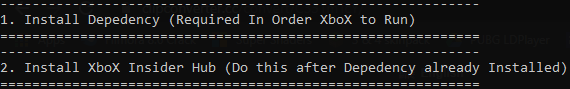
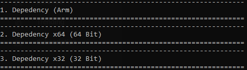

# Comp
Actually, this repository is intended for . It's a  (  ) .  . Anyways, You can go ahead to download this at "Releases" Section.

# Features
- Support for .
-  for .Appx package and Certificate.
- Support for  Architecture.

# Checking Your System Architecture
If you're clue-less about your system Architecture, There's one simple way to check'em :
- Go to Your Windows File Explorer (Shortcut : )
- Now find  and  on it.
- Simply choose  and Your PC Props will showed there, including Your System Architecture.

# Uses
To use this is quite easy, the  () with , If its not.. there's a message that will showed up informing that you're not running the file as Administrator.

Now go ahead, Re-Do the Execution with Administrator rights and now there's some option showing.  . Just  to choose'em.

Now there's another bunch of option showing up. Simply  . Do the same thing as before, just type the option that suits for You.

Almost Set-Up now!  . Fromt there, you can now install XboX Companion Aapp. Now  to choose the Installation and wait for the process till its done!

Congrats! You can now try to launch the XboX Companion App!
